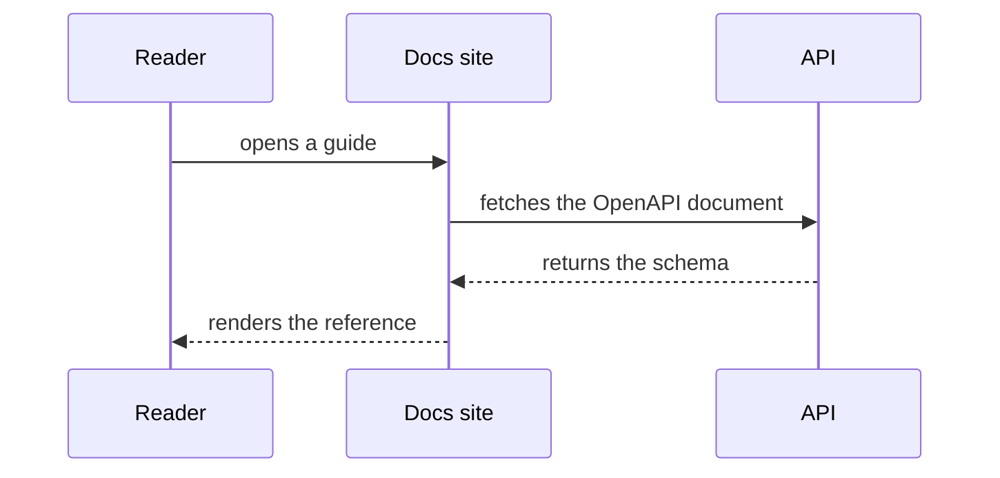

# EK-2518 PR A: docs template 2.6.0 Implementation Plan

> **For agentic workers:** REQUIRED SUB-SKILL: Use superpowers:subagent-driven-development (recommended) or superpowers:executing-plans to implement this plan task-by-task. Steps use checkbox (`- [ ]`) syntax for tracking.

**Goal:** Raise `ekline-docs-template-astro` to Astro 6.4.7 / Starlight 0.40.0, port EkLine's Starlight-0.40-synced component forks upstream, add Mermaid, and make the test suite pass for a fork that has disabled features or deleted the demo content.

**Architecture:** Three independent pieces in one release. The version bump needs a `vite` override and a from-scratch lockfile regeneration (both measured — see Global Constraints). The two component forks move upstream from `ekline-docs`, which already re-synced them against Starlight 0.40.0. The test changes make nine assertions conditional on the feature they describe actually being enabled, so a fork that switches a feature off gets a green suite instead of nine red tests.

**Tech Stack:** Astro 6.4.x, Starlight 0.40.0, Node 22.x, `node --test`, Playwright.

**Spec:** [`docs/superpowers/specs/2026-09-13-ekline-docs-template-parity-design.md`](../specs/2026-09-13-ekline-docs-template-parity-design.md)

**Repository:** `ekline-io/ekline-docs-template-astro` — **not** this one. Clone it and work in `packages/template/`. This plan lives here because EK-2518 coordinates both PRs; copy it to that repo's `docs/superpowers/plans/` as part of Task 6.

**Jira:** [EK-2518](https://ekline.atlassian.net/browse/EK-2518). That repo does not use Jira keys in branch names or PR titles (see its recent history: `pa-claude/<topic>-<hash>`), so follow its convention there. The key belongs on PR B only.

## Global Constraints

- **Target versions:** `astro` `^6.4.7`, `@astrojs/starlight` `^0.40.0`, `@astrojs/node` `^10.1.4`, `sharp` `^0.35.4`, `astro-mermaid` `^2.0.2`, `mermaid` `^11.16.1`. Node `22.x`.
- **Starlight 0.40.0 peers `astro: ^6.4.5`.** The two must move together; Starlight 0.40 cannot be taken on Astro 6.2.
- **`@astrojs/markdown-satteri` is an OPTIONAL peer of Starlight 0.40** (`peerDependenciesMeta: { optional: true }`). Do not add it. Verified: nothing installs it and npm emits no warning.
- **`overrides` MUST contain `"vite": "^7.3.6"`.** Astro 6.4.8 pulls Vite 8.3.0, and `@tailwindcss/vite@4.3.0` fails the build on it with ``Missing field `tsconfigPaths` on BindingViteResolvePluginConfig.resolveOptions``. Measured. `ekline-docs` already carries this override; this release is what moves it upstream. Keep the existing `"@scalar/astro": { "astro": "$astro" }` entry alongside it.
- **The lockfile MUST be regenerated from scratch**, never updated in place. `npm install` over the 2.5.0 lockfile hoists `@astrojs/markdown-remark@7.1.1`, and Astro 6.4.8 then dies with `The requested module '@astrojs/markdown-remark' does not provide an export named 'unified'`. A clean resolve hoists `7.3.1` and builds. Measured both ways.
- **Do not add an `npm workspaces` key.** The root `README.md` and `CLAUDE.md` explain why; the template ships as a directory copy and needs its own committed lockfile.
- Every command in this plan runs from `packages/template/` unless it says otherwise.

---

### Task 1: Upgrade dependencies and regenerate the lockfile

This task is the one with measured failure modes. Do it exactly in this order — installing before setting the override, or updating the lockfile in place, reproduces one of the two build failures above.

**Files:**
- Modify: `packages/template/package.json`
- Modify: `packages/template/package-lock.json` (regenerated, not hand-edited)

**Interfaces:**
- Consumes: nothing.
- Produces: a `packages/template/` that builds on Astro 6.4.x. Tasks 2–7 all assume this.

- [ ] **Step 1: Record the current build as the baseline**

```bash
cd packages/template
npm ci
npx astro build && echo "BASELINE OK"
```

Expected: `BASELINE OK`. If this fails before you have changed anything, stop — the problem is not this upgrade.

- [ ] **Step 2: Set the dependency versions and the vite override**

In `packages/template/package.json`, set these `dependencies` values:

```json
"astro": "^6.4.7",
"@astrojs/starlight": "^0.40.0",
"@astrojs/node": "^10.1.4",
"sharp": "^0.35.4",
```

`@astrojs/node` is currently the exact string `"10.1.1"`. Replace it with `"^10.1.4"` and **delete the comment above `adapter:` in `astro.config.mjs` that explains the pin** (it begins "`@astrojs/node` is held at an exact `10.1.1`"). The pin existed because 10.1.2+ needs an `astro/app/node` export that only Astro 6.4 ships. This release is Astro 6.4, so the reason is gone and leaving the comment would mislead the next reader.

Replace the whole `overrides` block with:

```json
"overrides": {
  "@scalar/astro": {
    "astro": "$astro"
  },
  "vite": "^7.3.6"
}
```

- [ ] **Step 3: Regenerate the lockfile from scratch**

```bash
rm -rf node_modules package-lock.json
npm install
```

Not `npm update`, not `npm install` over the existing lockfile. Deleting `package-lock.json` is the point of the step.

- [ ] **Step 4: Verify the resolution is the one that works**

```bash
node -p "require('./node_modules/vite/package.json').version"
node -p "require('./node_modules/@astrojs/markdown-remark/package.json').version"
node -p "require('./node_modules/astro/package.json').version"
```

Expected: vite `7.3.6`, markdown-remark `7.3.1`, astro `6.4.8` or higher.

If vite prints `8.x`, the override did not take — check it is in `overrides` and not `resolutions`. If markdown-remark prints `7.1.1`, the lockfile was not regenerated; repeat Step 3.

- [ ] **Step 5: Verify the build**

```bash
npx astro build && echo "UPGRADE BUILD OK"
```

Expected: `UPGRADE BUILD OK`.

If it fails with ``Missing field `tsconfigPaths` ``, vite resolved to 8.x — go back to Step 2.
If it fails with `does not provide an export named 'unified'`, the lockfile was stale — go back to Step 3.

- [ ] **Step 6: Commit**

```bash
git add packages/template/package.json packages/template/package-lock.json packages/template/astro.config.mjs
git commit -m "deps: Astro 6.4.7 and Starlight 0.40.0

Starlight 0.40 peers astro ^6.4.5, so the two move together. Two things
the upgrade needs, both measured:

  - overrides.vite ^7.3.6. Astro 6.4.8 pulls Vite 8.3.0 and
    @tailwindcss/vite 4.3.0 fails the build on it with 'Missing field
    tsconfigPaths on BindingViteResolvePluginConfig.resolveOptions'.
  - a lockfile regenerated from scratch. Updating in place hoists
    @astrojs/markdown-remark 7.1.1, and Astro then dies on a missing
    'unified' export; a clean resolve hoists 7.3.1.

Unpins @astrojs/node, which was held at exactly 10.1.1 only because the
template was below Astro 6.4."
```

---

### Task 2: Port the two Starlight component forks from ekline-docs

`CustomHeader.astro` and `CustomHero.astro` are forks of Starlight internals. The template's copies are synced against Starlight 0.39.2; `ekline-docs` re-synced its own against 0.40.0. Now that the template is on 0.40.0, its copies are the stale ones.

**Files:**
- Modify: `packages/template/src/components/CustomHeader.astro`
- Modify: `packages/template/src/components/CustomHero.astro`

**Interfaces:**
- Consumes: Task 1's Starlight 0.40.0.
- Produces: nothing other tasks import. Task 7 screenshots the result.

- [ ] **Step 1: Diff the template's copies against upstream 0.40.0**

```bash
diff src/components/CustomHeader.astro node_modules/@astrojs/starlight/components/Header.astro
diff src/components/CustomHero.astro node_modules/@astrojs/starlight/components/Hero.astro
```

Read both. The template's intentional deltas are documented in each file's header comment: `CustomHeader` centres desktop search with a `1fr auto 1fr` grid instead of offsetting by the sidebar; `CustomHero` adds a monospace eyebrow above the H1 and a dotted radial-gradient background. Everything else should match upstream.

- [ ] **Step 2: Re-sync each file against upstream 0.40.0, keeping the documented deltas**

Take upstream 0.40.0's markup as the base and re-apply only the deltas from Step 1, plus the template's own two additions that `ekline-docs` does not have:

- `CustomHeader.astro` keeps its `AuthControl` import, the `authConfigured` import from `../config/auth.mjs`, and the `{authConfigured() && <AuthControl />}` line in the right-hand cluster.
- `CustomHero.astro` keeps `<p class="eyebrow">Documentation</p>` — `ekline-docs` says `EkLine` there, which is its content, not the template's.

Do not copy `ekline-docs`'s files wholesale. They have the auth pieces removed, and this repo needs them.

- [ ] **Step 3: Verify the build and type-check**

```bash
npx astro build && npm run check && echo "COMPONENTS OK"
```

Expected: `COMPONENTS OK`.

- [ ] **Step 4: Update the re-sync note in each file**

Both headers tell the reader to re-sync on every Starlight minor bump. Add the version actually synced against, so the next person can tell whether it is current:

```
 *   node_modules/@astrojs/starlight/components/Header.astro
 *
 * Last re-synced against Starlight 0.40.0.
```

- [ ] **Step 5: Commit**

```bash
git add packages/template/src/components/CustomHeader.astro packages/template/src/components/CustomHero.astro
git commit -m "fix: re-sync the Header and Hero forks against Starlight 0.40.0

Both are forks of Starlight internals and were synced against 0.39.2.
Records the version each was synced against, so staleness is visible
rather than inferred."
```

---

### Task 3: Add Mermaid diagram support

**Files:**
- Modify: `packages/template/package.json`
- Modify: `packages/template/astro.config.mjs`
- Create: `packages/template/src/content/docs/guides/diagrams.mdx`

**Interfaces:**
- Consumes: Task 1's dependency set.
- Produces: a `mermaid()` entry in `integrations`. Task 7 builds it.

- [ ] **Step 1: Install**

```bash
npm install astro-mermaid@^2.0.2 mermaid@^11.16.1
```

- [ ] **Step 2: Register the integration**

In `astro.config.mjs`, add the import beside the other integration imports:

```js
import mermaid from 'astro-mermaid';
```

Add this as the **first** entry of the `integrations` array, before `sitemap(...)`:

```js
		// Renders ```mermaid fences as diagrams. Must precede starlight() —
		// it rewrites the fence before Starlight's syntax highlighter claims
		// it, and after starlight() the fence is already a <pre> of code.
		mermaid({
			autoTheme: true,
		}),
```

`autoTheme: true` follows the site's light/dark setting rather than pinning one palette.

- [ ] **Step 3: Add a page that proves it renders**

Create `packages/template/src/content/docs/guides/diagrams.mdx`:

````mdx
---
title: Diagrams
description: Mermaid diagrams render from a fenced code block, with no component to import.
---

Fence a diagram as `mermaid` and it renders. There is nothing to import, and
the diagram follows your site's light and dark themes.



Delete this page once you have seen it work — it documents the template, not
your product. Removing `astro-mermaid` from `astro.config.mjs` and
uninstalling `astro-mermaid` and `mermaid` drops the feature entirely.
````

- [ ] **Step 4: Add it to the sidebar**

In `src/config/sidebar.mjs`, add to the `Guides` group's `items` array, after the existing two entries:

```js
			{ label: 'Diagrams', slug: 'guides/diagrams' },
```

- [ ] **Step 5: Verify it renders as a diagram, not a code block**

```bash
npx astro build
grep -c 'class="mermaid"' dist/client/guides/diagrams/index.html
```

Expected: `1` or higher. A `0` means the integration ran after `starlight()` — check the ordering from Step 2.

- [ ] **Step 6: Commit**

```bash
git add packages/template/package.json packages/template/package-lock.json packages/template/astro.config.mjs packages/template/src/content/docs/guides/diagrams.mdx packages/template/src/config/sidebar.mjs
git commit -m "feat: Mermaid diagrams from a fenced code block

astro-mermaid is registered ahead of starlight() because it rewrites the
fence before the syntax highlighter claims it. Ships one example page,
marked for deletion, so the feature is visible on real content."
```

---

### Task 4: Make the API-reference tests tolerate all references being disabled

Seven tests assert facts about the template's own three shipped references. A fork that sets `enabled: false` on all of them — the supported way to turn the feature off — gets seven failures. Measured: `api-reference-config.test.mjs` 2 failures, `scalar-api-reference.test.mjs` 5.

The fix is not to weaken the assertions. Each one is worth keeping *when references are enabled*; they should skip when none is.

**Files:**
- Modify: `packages/template/tests/api-reference-config.test.mjs:245`, `:262`
- Modify: `packages/template/tests/scalar-api-reference.test.mjs:46`

**Interfaces:**
- Consumes: `enabledReferences` from `src/config/api-reference.mjs` (already imported in both files).
- Produces: nothing other tasks import.

- [ ] **Step 1: Reproduce the failures**

```bash
node -e '
const fs = require("fs");
const p = "src/config/api-reference.mjs";
fs.writeFileSync(p + ".bak", fs.readFileSync(p));
fs.writeFileSync(p, fs.readFileSync(p, "utf8").replace(/\n\t\tenabled: true,/g, "\n\t\tenabled: false,"));
'
npx astro build
node --test tests/api-reference-config.test.mjs tests/scalar-api-reference.test.mjs 2>&1 | grep -E "^# (pass|fail)"
```

Expected: `# fail 7`.

- [ ] **Step 2: Add a shared skip condition to `api-reference-config.test.mjs`**

Below the existing imports, add:

```js
// These assertions describe the references this template SHIPS. A fork that
// has disabled every reference — the supported way to drop the feature — has
// nothing for them to describe, and should get a green suite rather than a
// failure telling it to re-enable a feature it deliberately turned off.
const noReferences = enabledReferences.length === 0;
const unlessDisabled = noReferences ? 'every API reference is disabled' : false;
```

- [ ] **Step 3: Apply it to the two failing tests**

Change line 245 from:

```js
test('no shipped reference sets specUrl', () => {
```

to:

```js
test('no shipped reference sets specUrl', { skip: unlessDisabled }, () => {
```

Change line 262 from:

```js
test('the remote example is live, not snapshotted', () => {
```

to:

```js
test('the remote example is live, not snapshotted', { skip: unlessDisabled }, () => {
```

Leave the `assert.ok(enabledReferences.length >= 1)` inside the first one. With the skip in place it only runs when that is true, and it still guards the case where the list is emptied by deletion rather than by the flag.

- [ ] **Step 4: Apply the same treatment in `scalar-api-reference.test.mjs`**

Add the identical two lines below its imports, then change line 46 from:

```js
test('more than one reference is configured', () => {
```

to:

```js
test('more than one reference is configured', { skip: unlessDisabled }, () => {
```

The other four failures in this file (`the sidebar lists operations generated from the OpenAPI document`, `generated sidebar anchors match the hashes Scalar assigns`, `operation links carry their HTTP method as a badge`, `the operation list is reachable from ordinary docs pages`) read the built output for a reference that no longer exists. Add `{ skip: unlessDisabled }` to each of those four in the same way.

- [ ] **Step 5: Verify green with references disabled**

```bash
node --test tests/api-reference-config.test.mjs tests/scalar-api-reference.test.mjs 2>&1 | grep -E "^# (pass|fail|skipped)"
```

Expected: `# fail 0`, with `# skipped` having risen by 7.

- [ ] **Step 6: Verify still green with references enabled**

```bash
mv src/config/api-reference.mjs.bak src/config/api-reference.mjs
npx astro build
node --test tests/api-reference-config.test.mjs tests/scalar-api-reference.test.mjs 2>&1 | grep -E "^# (pass|fail|skipped)"
```

Expected: `# fail 0` and `# skipped 0` for these two files. This step is the one that proves the skip is conditional rather than permanent.

- [ ] **Step 7: Commit**

```bash
git add packages/template/tests/api-reference-config.test.mjs packages/template/tests/scalar-api-reference.test.mjs
git commit -m "test: skip the shipped-reference assertions when none is enabled

Seven tests describe the three references this template ships. Setting
enabled: false on all of them is the supported way to drop the feature,
and it turned those seven red — a fork was told to re-enable something it
had deliberately switched off. They now skip when the list is empty and
run unchanged when it is not."
```

---

### Task 5: Make the demo-content tests tolerate the content being deleted

Two tests require the shipped demo pages to exist. Deleting `src/content/private-docs/` and `src/content/org-docs/{acme,globex}` is what a real fork does — they are fixtures for invented companies — and it turns both red.

These two differ from Task 4: the assertions are *correct* and worth keeping. `private-leaks` says so explicitly in its own comment — it wants to fail loudly when the examples are replaced, because the leak tests below it lose their sentinel. The fix is to distinguish "replaced with your own content" (still fail: the sentinel needs re-adding) from "removed entirely" (skip: there is no private content to leak).

**Files:**
- Modify: `packages/template/tests/private-leaks.test.mjs:87`
- Modify: `packages/template/tests/demo-login.test.mjs:59`

**Interfaces:**
- Consumes: nothing from earlier tasks.
- Produces: nothing other tasks import.

- [ ] **Step 1: Reproduce the failures**

```bash
mkdir -p /tmp/ek-demo-backup
cp -R src/content/private-docs src/content/org-docs /tmp/ek-demo-backup/
rm -rf src/content/private-docs/* src/content/org-docs/acme src/content/org-docs/globex
npx astro build
node --test tests/private-leaks.test.mjs tests/demo-login.test.mjs 2>&1 | grep -E "^# (pass|fail)"
```

Expected: `# fail 2`.

- [ ] **Step 2: Skip the private-leaks sentinel when there is no private content at all**

In `tests/private-leaks.test.mjs`, above the test at line 87, add:

```js
// An empty collection is not the same as replaced content. A fork that
// deleted the shipped examples outright has no private pages, so there is
// nothing for the leak tests below to detect and nothing to sentinel — skip.
// A fork that REPLACED them still fails, which is the signal this test exists
// to give: the new content needs a sentinel of its own.
const privateSources = [
	'src/content/private-docs/index.mdx',
	'src/content/private-docs/example-private-guide.mdx',
	'src/content/org-docs/acme/index.mdx',
	'src/content/org-docs/globex/index.mdx',
];
const noPrivateContent = walk(join(ROOT, 'src/content/private-docs')).length === 0 &&
	walk(join(ROOT, 'src/content/org-docs')).length === 0;
const unlessNoPrivateContent = noPrivateContent ? 'no private or org content is present' : false;
```

Then change line 87 from:

```js
test('the sentinel exists in the private source content (guards the guard)', () => {
```

to:

```js
test('the sentinel exists in the private source content (guards the guard)', { skip: unlessNoPrivateContent }, () => {
```

Read the file first — it already defines `walk` and `ROOT`, and it already builds a `sources` array inside the test. Reuse the existing names rather than shadowing them; if `sources` is already at module scope, drop the `privateSources` duplicate above and use it.

- [ ] **Step 3: Skip the persona-orgs test when the org folders are gone**

In `tests/demo-login.test.mjs`, above the test at line 59, add:

```js
// The personas point at the shipped example org folders. A fork that deleted
// them has no orgs to name, and the demo login it would drive is off anyway
// (DOCS_UNSAFE_DEMO_LOGIN). A fork that kept SOME folders still gets checked.
const orgDocsRoot = join(ROOT, 'src/content/org-docs');
const orgFolders = existsSync(orgDocsRoot)
	? readdirSync(orgDocsRoot, { withFileTypes: true }).filter((e) => e.isDirectory())
	: [];
const unlessNoOrgs = orgFolders.length === 0 ? 'no org-docs folders are present' : false;
```

Then change line 59 from:

```js
test('persona orgs name real folders under src/content/org-docs/', () => {
```

to:

```js
test('persona orgs name real folders under src/content/org-docs/', { skip: unlessNoOrgs }, () => {
```

Add `existsSync` to the `node:fs` import at the top of the file if it is not already there.

- [ ] **Step 4: Verify green with the content deleted**

```bash
node --test tests/private-leaks.test.mjs tests/demo-login.test.mjs 2>&1 | grep -E "^# (pass|fail|skipped)"
```

Expected: `# fail 0`.

- [ ] **Step 5: Verify still green with the content restored**

```bash
rm -rf src/content/private-docs src/content/org-docs
cp -R /tmp/ek-demo-backup/private-docs /tmp/ek-demo-backup/org-docs src/content/
npx astro build
node --test tests/private-leaks.test.mjs tests/demo-login.test.mjs 2>&1 | grep -E "^# (pass|fail|skipped)"
```

Expected: `# fail 0` and `# skipped 0` for these two files.

- [ ] **Step 6: Commit**

```bash
git add packages/template/tests/private-leaks.test.mjs packages/template/tests/demo-login.test.mjs
git commit -m "test: skip the demo-content assertions when that content is gone

Deleting the Acme and Globex example pages is what a real fork does, and
it turned two tests red. They now distinguish removed content, where there
is nothing to sentinel and nothing to leak, from replaced content, which
still fails loudly because the new pages need a sentinel of their own."
```

---

### Task 6: Record that docs.ekline.io tracks this template, and release 2.6.0

**Files:**
- Modify: `packages/template/CLAUDE.md`
- Modify: `packages/template/CHANGELOG.md`
- Modify: `packages/template/package.json` (version)
- Create: `docs/superpowers/plans/2026-09-13-docs-template-2.6.0.md` (this file, copied into that repo)

**Interfaces:**
- Consumes: everything Tasks 1–5 changed, which the CHANGELOG describes.
- Produces: the released version string PR B pins against.

- [ ] **Step 1: Update the verified-baseline line in `CLAUDE.md`**

It currently reads:

```
Verified baseline: Astro `^6.2.2`, Starlight `^0.39.2`, Node 22.x.
```

Replace with:

```
Verified baseline: Astro `^6.4.7`, Starlight `^0.40.0`, Node 22.x.
```

- [ ] **Step 2: Add the downstream note to `CLAUDE.md`**

Add this as a new section immediately after `## What this is`:

```markdown
## A real site tracks this template

EkLine's own documentation site, <https://docs.ekline.io>, is built from this
template and is kept at **full code parity with it** — it holds the same files
and switches off what it does not use (`enabled: false` in
`src/config/api-reference.mjs`; the `DOCS_SSO_*` and `DOCS_UNSAFE_DEMO_LOGIN`
variables left unset; components left out of the `components:` map). It does
not follow `removing-features.md`.

Two consequences for changes made here:

1. **A breaking change needs a `CHANGELOG.md` entry saying what to pull
   across.** That file is how a downstream site learns what a release means for
   it, and it is the only channel — a fork receives no automatic update.
2. **A test must not assume this template's own demo configuration is live.**
   A fork that disables a feature or deletes the example content is the normal
   case, not a broken one. Gate such assertions with `{ skip: ... }` on the
   feature being enabled, the way `tests/api-reference-config.test.mjs` and
   `tests/private-leaks.test.mjs` now do.

The reasoning is recorded in EkLine's repository at
`docs/superpowers/specs/2026-09-13-ekline-docs-template-parity-design.md`
(EK-2518).
```

- [ ] **Step 3: Write the 2.6.0 CHANGELOG entry**

Insert immediately below the intro paragraph and above `## 2.5.0`:

```markdown
## 2.6.0

### Astro 6.4 and Starlight 0.40

Starlight 0.40 requires Astro `^6.4.5`, so the two move together. Upgrading a
fork needs two things that are easy to miss, both of which fail the build
rather than degrading quietly:

- **`overrides` must pin `"vite": "^7.3.6"`.** Astro 6.4.8 resolves Vite 8.3.0,
  and `@tailwindcss/vite` 4.3.0 fails on it with ``Missing field
  `tsconfigPaths` on BindingViteResolvePluginConfig.resolveOptions``.
- **Regenerate `package-lock.json` from scratch** — `rm -rf node_modules
  package-lock.json && npm install`. Updating it in place hoists
  `@astrojs/markdown-remark@7.1.1`, and Astro then fails with `does not provide
  an export named 'unified'`. A clean resolve hoists `7.3.1`.

`@astrojs/node` is no longer pinned to an exact `10.1.1`. That pin existed only
because the template was below Astro 6.4; it is now `^10.1.4`.

`@astrojs/markdown-satteri` appears as a new Starlight peer. It is optional —
do not install it.

**What to pull across:** the four dependency bumps, the `vite` override, and a
regenerated lockfile. `CustomHeader.astro` and `CustomHero.astro` are forks of
Starlight internals and were re-synced against 0.40.0 — if you have customised
either, re-sync yours too rather than taking these.

### Mermaid diagrams

Fence a diagram as ```mermaid and it renders, following your light/dark theme.
No component to import. One example page ships at `/guides/diagrams/`, marked
for deletion.

**What to pull across:** `astro-mermaid` and `mermaid`, plus the `mermaid()`
entry in `integrations` — which must sit **before** `starlight()`, since it
rewrites the fence before the syntax highlighter claims it.

### Disabling a feature no longer fails the test suite

Nine tests assumed this template's own demo configuration was live. Setting
`enabled: false` on all three API references — the supported way to drop that
feature — turned seven of them red, and deleting the Acme and Globex example
pages turned the other two red. A fork was being told to re-enable things it
had deliberately switched off.

Those nine now skip when the thing they describe is absent, and run unchanged
when it is present. Replacing the private examples with your own content still
fails `private-leaks`, which is the signal that test exists to give: your pages
need a sentinel of their own.

**What to pull across:** nothing, unless you have hit this. It only changes
test files.
```

- [ ] **Step 4: Bump the version**

In `packages/template/package.json`, change `"version": "2.5.0"` to `"version": "2.6.0"`.

- [ ] **Step 5: Copy this plan into the repo**

```bash
mkdir -p docs/superpowers/plans
# copy 2026-09-13-docs-template-2.6.0.md from the ekline-app repo to here
git add docs/superpowers/plans/2026-09-13-docs-template-2.6.0.md
```

- [ ] **Step 6: Commit**

```bash
git add packages/template/CLAUDE.md packages/template/CHANGELOG.md packages/template/package.json docs/superpowers/plans/
git commit -m "chore: release 2.6.0

Records that docs.ekline.io tracks this template at full code parity, and
what that obliges: a breaking change needs a CHANGELOG entry saying what
to pull across, and a test must not assume this template's own demo
configuration is live."
```

---

### Task 7: Full verification

**Files:** none modified.

**Interfaces:**
- Consumes: Tasks 1–6.
- Produces: the evidence PR A is done.

- [ ] **Step 1: Run the whole suite as shipped**

```bash
npm test
```

Expected: `# fail 0`. The shipped configuration has every feature enabled, so nothing added in Tasks 4 and 5 should skip.

```bash
node --test tests/*.test.mjs 2>&1 | grep -E "^# (pass|fail|skipped)"
```

Record the three numbers. `# skipped` should be `13`, unchanged from before this PR — the pre-existing skips are the Vercel-only tests.

- [ ] **Step 2: Run the suite with every optional feature off**

```bash
cp src/config/api-reference.mjs /tmp/ek-api-ref.bak
node -e 'const fs=require("fs");const p="src/config/api-reference.mjs";fs.writeFileSync(p,fs.readFileSync(p,"utf8").replace(/\n\t\tenabled: true,/g,"\n\t\tenabled: false,"))'
cp -R src/content/private-docs src/content/org-docs /tmp/ek-demo-backup2/
rm -rf src/content/private-docs/* src/content/org-docs/acme src/content/org-docs/globex
npx astro build
node --test tests/*.test.mjs 2>&1 | grep -E "^# (pass|fail|skipped)"
```

Expected: `# fail 0`. This is the configuration PR B ships, and it is the whole reason Tasks 4 and 5 exist. Before this PR the same command gave `# fail 9`.

- [ ] **Step 3: Restore**

```bash
cp /tmp/ek-api-ref.bak src/config/api-reference.mjs
cp -R /tmp/ek-demo-backup2/private-docs /tmp/ek-demo-backup2/org-docs src/content/
git status --short
```

Expected: no changes to tracked files. If `git status` shows any, the restore was incomplete — fix before continuing.

- [ ] **Step 4: Type-check and visual tests**

```bash
npm run check
npm run test:visual
```

`test:visual` includes `tests/visual/theme-control.spec.mjs` and a committed screenshot baseline at `tests/visual/__screenshots__/darwin/sidebar-operations.png`. The Starlight 0.40 upgrade and the Task 2 component re-sync may legitimately change rendering.

**If a screenshot test fails, do not run `--update-snapshots` reflexively.** Open the diff the report gives you and look at it. A changed baseline is only correct if the change is one you intended; re-baselining a regression is how a regression ships. If the change is intended, regenerate with `npm run test:visual:update` and say in the PR body what moved and why.

- [ ] **Step 5: Raise the PR**

```bash
gh pr create \
  --title "Astro 6.4 / Starlight 0.40, Mermaid, and a test suite that survives disabled features" \
  --body "..."
```

Follow that repo's own branch convention (`pa-claude/<topic>-<hash>`). No Jira key — that repo does not use them.

The body must state: the two measured upgrade traps and their fixes, that nine tests previously failed for a fork with features disabled, and whether any visual baseline changed and why.

---

## Self-Review

**Spec coverage.** The spec's PR A scope is "raise to Astro 6.4.7 / Starlight 0.40.0; port the `CustomHeader` and `CustomHero` forks; unpin `@astrojs/node`; add `astro-mermaid`; `CHANGELOG.md` entry" plus the `packages/template/CLAUDE.md` note from *Recording the decision*. Tasks 1, 2, 3, 6 cover those.

Tasks 4, 5 and Step 2 of Task 7 are **not in the spec** — they came out of measuring the suite with features disabled, which returned `# fail 9`. The spec assumes PR B inherits a green suite, and without these it would inherit nine failures. This is a scope addition and is called out to the user rather than absorbed silently.

**Placeholder scan.** One remains by necessity: Task 7 Step 5's `--body "..."`, whose required content is spelled out in the sentence below it. Task 6 Step 5 says "copy from the ekline-app repo" without an absolute path because the clone location is the implementer's choice.

**Type consistency.** `unlessDisabled` is defined once per file in Tasks 4 (two files) and used only there. `unlessNoPrivateContent` and `unlessNoOrgs` are defined and used within their own files in Task 5. Task 5 Step 2 explicitly warns that `walk`, `ROOT` and `sources` already exist in `private-leaks.test.mjs` and must be reused rather than shadowed.
