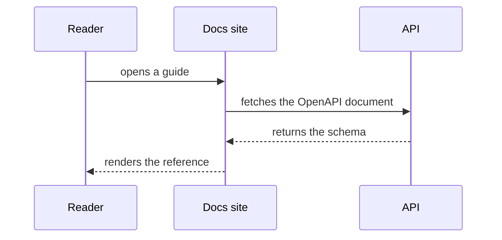

Fence a diagram as `mermaid` and it renders. There is nothing to import, and
the diagram follows your site's light and dark themes.

Delete this page once you have seen it work — it documents the template, not
your product. Removing `astro-mermaid` from `astro.config.mjs` and
uninstalling `astro-mermaid` and `mermaid` drops the feature entirely.
